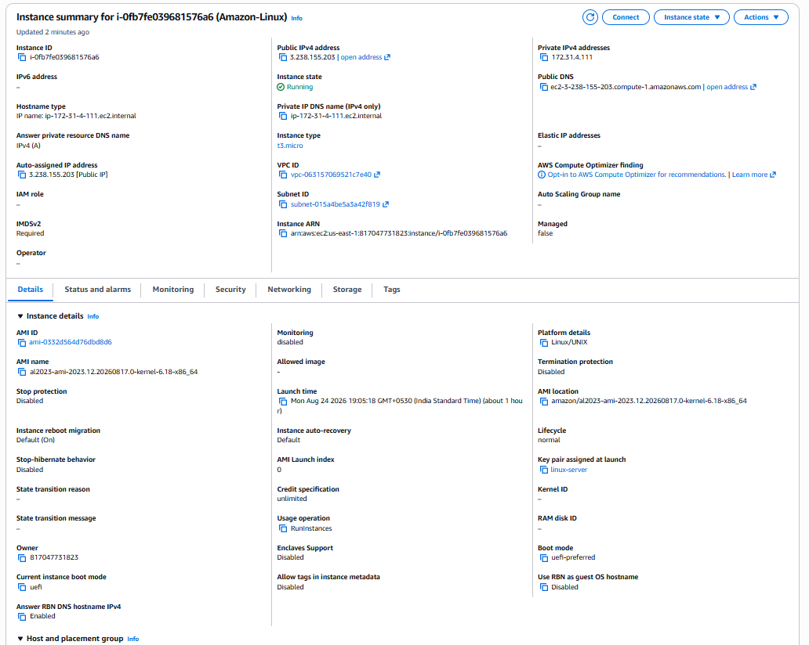
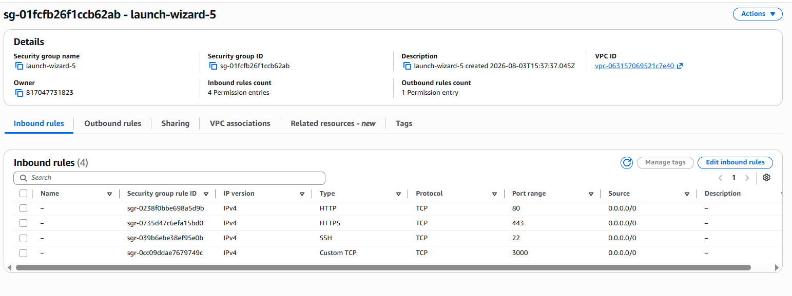
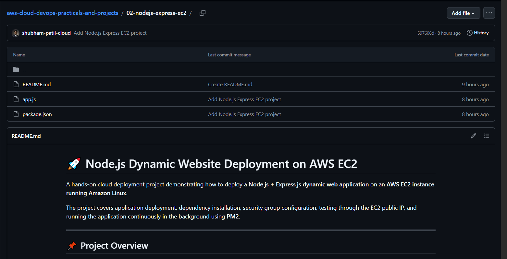
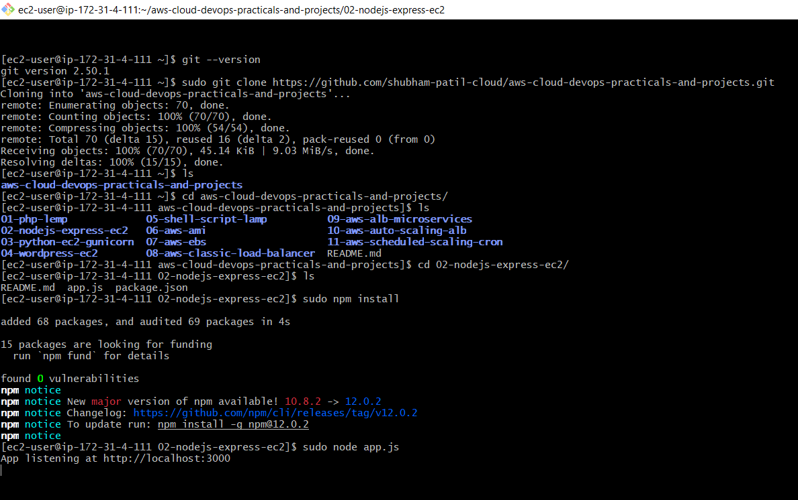
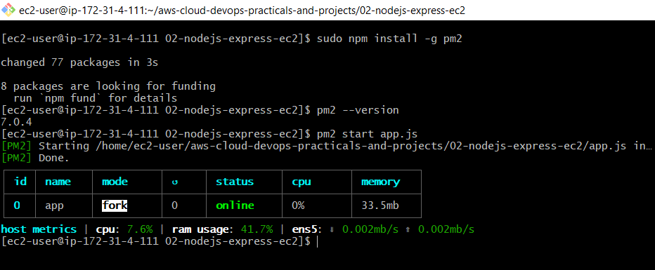
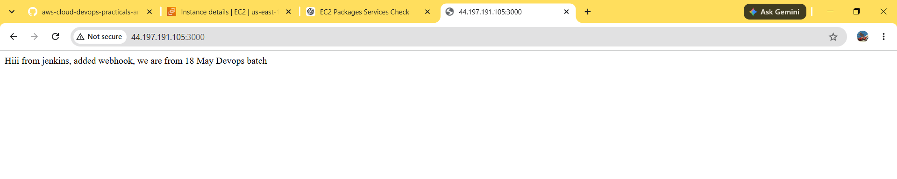

# 🚀 Node.js Dynamic Website Deployment on AWS EC2

A hands-on cloud deployment project demonstrating how to deploy a **Node.js + Express.js dynamic web application** on an **AWS EC2 instance running Amazon Linux**.

The project covers application deployment, dependency installation, security group configuration, testing through the EC2 public IP, and running the application continuously in the background using **PM2**.

---

## 📌 Project Overview

In this project, a Node.js/Express.js application is deployed on an AWS EC2 instance.

### Deployment Flow

```text
Developer
   │
   │ GitHub Repository
   ▼
AWS EC2 Instance
(Amazon Linux)
   │
   ├── Node.js
   ├── npm
   ├── Git
   │
   ▼
Express.js Application
   │
   ▼
Port 3000
   │
   ▼
EC2 Security Group
   │
   ▼
Internet
```

---

## 🛠️ Technologies Used

| Technology   | Purpose                                  |
| ------------ | ---------------------------------------- |
| AWS EC2      | Cloud server for hosting the application |
| Amazon Linux | Operating system                         |
| Node.js      | JavaScript runtime                       |
| Express.js   | Web application framework                |
| npm          | Package and dependency management        |
| Git          | Version control                          |
| GitHub       | Source code repository                   |
| PM2          | Process manager for Node.js              |
| SSH          | Remote access to EC2                     |

---

## ☁️ AWS Architecture

```text
                    Internet
                       │
                       │ HTTP :3000
                       ▼
              ┌──────────────────┐
              │ AWS EC2 Instance │
              │   Amazon Linux   │
              └────────┬─────────┘
                       │
                       ▼
                Node.js / Express
                       │
                       ▼
                    app.js
                       │
                       ▼
                   Port 3000
```

---

# ⚙️ Deployment Steps

## 1. Launch AWS EC2 Instance

Create an EC2 instance with:

* **AMI:** Amazon Linux
* **Instance Type:** Suitable free-tier/learning instance
* **Key Pair:** Required for SSH access
* **Security Group:** Allow SSH and application traffic

Required inbound rules:

```text
SSH
Port: 22
Source: Your IP

Custom TCP
Port: 3000
Source: 0.0.0.0/0
```

> For production environments, avoid exposing port `3000` directly to the internet. A reverse proxy such as Nginx with HTTP/HTTPS is recommended.

---

## 2. Connect to EC2 Using SSH

Connect to the Amazon Linux EC2 instance:

```bash
ssh -i "your-key.pem" ec2-user@<EC2-PUBLIC-IP>
```

---

## 3. Update the System

```bash
sudo yum update -y
```

---

## 4. Install Node.js and npm

```bash
sudo yum install nodejs npm -y
```

Verify the installation:

```bash
node --version
npm --version
```

---

## 5. Install Git

```bash
sudo yum install git -y
```

Verify Git:

```bash
git --version
```

---

# 📥 6. Clone the Project From GitHub

Copy the HTTPS URL of the GitHub repository.

Then clone the project:

```bash
git clone <GITHUB-REPOSITORY-URL>
```

Check the downloaded files:

```bash
ls
```

Enter the project directory:

```bash
cd <PROJECT-DIRECTORY>
```

Verify the project files:

```bash
ls
```

You should see files such as:

```text
app.js
package.json
package-lock.json
```

---

# 📦 7. Install Project Dependencies

Inside the project directory, run:

```bash
npm install
```

`npm install` reads the `package.json` file and installs the required Node.js dependencies into the `node_modules` directory.

After installation:

```text
Project
│
├── app.js
├── package.json
├── package-lock.json
└── node_modules/
```

---

# ▶️ 8. Run the Website

Start the Node.js application:

```bash
node app.js
```

If the application is configured to listen on port `3000`, it should be available at:

```text
http://localhost:3000
```

On your local browser, access the application using the EC2 public IP:

```text
http://<EC2-PUBLIC-IP>:3000
```

Example:

```text
http://54.xx.xx.xx:3000
```

---

# 🔐 9. Configure EC2 Security Group

If the website is not accessible from your browser, check the EC2 Security Group.

Add an inbound rule:

```text
Type:        Custom TCP
Port:        3000
Source:      0.0.0.0/0
```

Then access:

```text
http://<EC2-PUBLIC-IP>:3000
```

### Important

The Node.js application must listen on an address accessible from outside the EC2 instance.

For example:

```javascript
app.listen(3000, '0.0.0.0', () => {
    console.log('Server running on port 3000');
});
```

---

# 🛑 10. Stop the Website

When running:

```bash
node app.js
```

the application runs in the foreground.

To stop it:

```text
CTRL + C
```

The website will stop because the Node.js process has been terminated.

---

# 🔄 11. Run the Website in Background Using PM2

Instead of keeping the terminal open, use **PM2**, a process manager for Node.js applications.

Install PM2 globally:

```bash
sudo npm install -g pm2
```

Verify the installation:

```bash
pm2 --version
```

---

## 12. Start the Application Using PM2

Inside the project directory:

```bash
pm2 start app.js
```

Check the application status:

```bash
pm2 status
```

Example:

```text
┌────┬──────────┬─────────┬────────┬─────────┐
│ id │ name     │ mode    │ status │ uptime  │
├────┼──────────┼─────────┼────────┼─────────┤
│ 0  │ app      │ fork    │ online │ ...     │
└────┴──────────┴─────────┴────────┴─────────┘
```

The application now runs in the background.

---

# 🧰 PM2 Commands

### Start Application

```bash
pm2 start app.js
```

### Check Status

```bash
pm2 status
```

### Stop Application

```bash
pm2 stop app.js
```

### Restart Application

```bash
pm2 restart app.js
```

Useful after making changes to the application code.

### View Application Logs

```bash
pm2 logs
```

### Exit Logs

```text
CTRL + C
```

### Delete Application From PM2

```bash
pm2 delete app.js
```

---

# 🔁 PM2 Process Flow

```text
                PM2
                 │
                 ▼
             app.js
                 │
                 ▼
          Node.js Server
                 │
                 ▼
             Port 3000
                 │
                 ▼
        EC2 Security Group
                 │
                 ▼
              Browser
```

---

# 🧪 Testing

After starting the application with PM2:

```bash
pm2 status
```

Confirm that the application status is:

```text
online
```

Then open:

```text
http://<EC2-PUBLIC-IP>:3000
```

The deployed Node.js website should load in the browser.

---

# 🔍 Troubleshooting

## Website Not Opening

Check whether the application is running:

```bash
pm2 status
```

Check application logs:

```bash
pm2 logs
```

Check whether port `3000` is listening:

```bash
sudo ss -lntp | grep 3000
```

Check the EC2 Security Group and make sure TCP port `3000` is allowed.

---

## Application Stops After Closing SSH

If the application was started with:

```bash
node app.js
```

it runs in the foreground and can stop when the session ends.

Use PM2 instead:

```bash
pm2 start app.js
```

---

# 📚 Key Learnings

Through this project, I learned how to:

* Launch and configure an AWS EC2 instance
* Connect to an EC2 instance using SSH
* Work with Amazon Linux
* Install Node.js and npm
* Install and use Git
* Clone a project from GitHub
* Install Node.js project dependencies
* Run an Express.js application
* Configure AWS Security Group inbound rules
* Expose an application using a custom TCP port
* Deploy a dynamic website on AWS EC2
* Use PM2 to manage Node.js processes
* Monitor application status and logs
* Restart and stop Node.js applications

---

# 🚀 Future Improvements

The current deployment exposes the Node.js application directly through port `3000`.

For a more production-ready architecture, the project can be improved by adding:

* Nginx as a reverse proxy
* HTTPS/SSL using a domain name
* AWS Application Load Balancer
* Auto Scaling
* Amazon CloudWatch monitoring
* Route 53 for DNS
* CI/CD using GitHub Actions
* Environment variables for application secrets
* AWS IAM best practices
* Docker containerization

A production architecture could look like:

```text
                    Users
                      │
                      ▼
                Route 53 / DNS
                      │
                      ▼
                 HTTPS :443
                      │
                      ▼
          Application Load Balancer
                      │
                      ▼
                 EC2 Instance
                      │
                    Nginx
                      │
                      ▼
                     PM2
                      │
                      ▼
              Node.js / Express
```

---

# 📸 Screenshots :

## EC2 Instance : 
## Security Group : 
## GitHub Repo : 
## NPM Installation : 
## PM2 Status : 
## Deployed Website : 

# 👨‍💻 Author

***Shubham Patil***

**B.Tech Computer Science & Engineering Student**

Aspiring AWS Cloud Engineer | Linux | AWS | Cloud & DevOps

---

## ⭐ Project Highlights

```text
AWS EC2
   ↓
Amazon Linux
   ↓
Node.js + Express.js
   ↓
GitHub
   ↓
npm install
   ↓
Port 3000
   ↓
  PM2
   ↓
Dynamic Website
```

> This project demonstrates a practical deployment workflow for hosting a Node.js dynamic application on AWS EC2.
