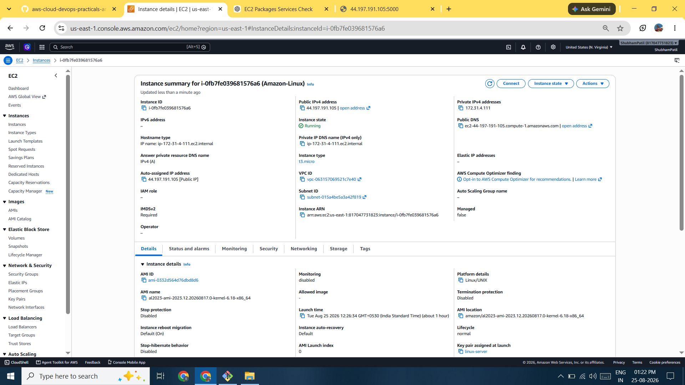
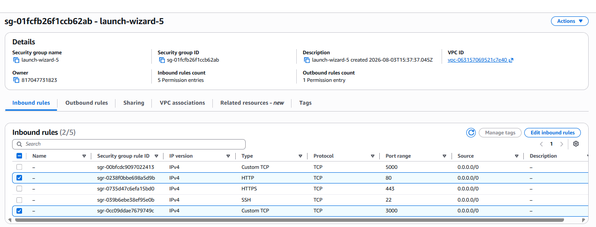
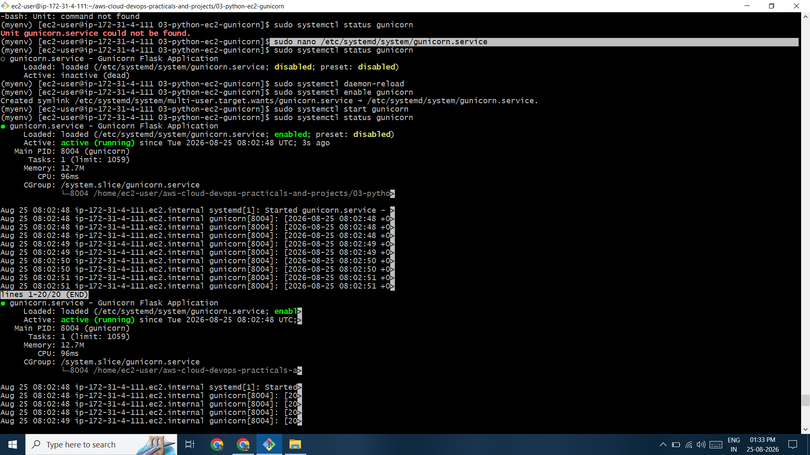
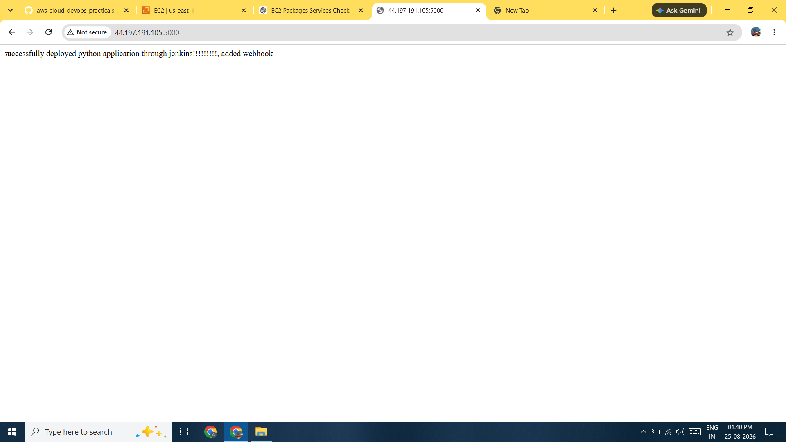

# 🐍 Python Dynamic Website Deployment on AWS EC2

A hands-on cloud deployment project demonstrating how to deploy a **Python dynamic web application** on an **AWS EC2 instance running Amazon Linux**.

The project covers Python installation, GitHub project cloning, virtual environment creation, dependency management using `requirements.txt`, application deployment, AWS Security Group configuration, and running the application in the background using **Gunicorn**.

---

## 📌 Project Overview

In this project, a Python-based dynamic web application is deployed on an AWS EC2 instance.

### Deployment Flow

```text
Developer
   │
   │ GitHub Repository
   ▼
AWS EC2 Instance
(Amazon Linux)
   │
   ├── Python 3
   ├── pip
   └── Git
   │
   ▼
Python Application
   │
   ▼
Virtual Environment
   │
   ▼
Application Dependencies
   │
   ▼
Gunicorn
   │
   ▼
Port 5000
   │
   ▼
EC2 Security Group
   │
   ▼
Internet
```

---

## 🛠️ Technologies Used

| Technology          | Purpose                                  |
| ------------------- | ---------------------------------------- |
| AWS EC2             | Cloud server for hosting the application |
| Amazon Linux        | Operating system                         |
| Python 3            | Application runtime                      |
| pip                 | Python package management                |
| Git                 | Version control                          |
| GitHub              | Source code repository                   |
| Virtual Environment | Isolated Python environment              |
| Gunicorn            | Python WSGI application server           |
| SSH                 | Remote access to EC2                     |

---

# ☁️ AWS Architecture

```text
                    Internet
                       │
                       │ HTTP :5000
                       ▼
              ┌──────────────────┐
              │  AWS EC2 Instance │
              │   Amazon Linux    │
              └────────┬─────────┘
                       │
                       ▼
                Gunicorn Server
                       │
                       ▼
                Python Application
                       │
                       ▼
                    Port 5000
```

---

# ⚙️ Deployment Steps

## 1. Launch AWS EC2 Instance

Create an EC2 instance with:

* **AMI:** Amazon Linux
* **Instance Type:** Suitable instance for learning
* **Key Pair:** Required for SSH access
* **Security Group:** Allow SSH and application traffic

### Required Inbound Rules

```text
SSH
Port: 22
Source: Your IP

Custom TCP
Port: 5000
Source: 0.0.0.0/0
```

> For production environments, it is recommended to use a reverse proxy such as Nginx and expose HTTP/HTTPS instead of directly exposing port `5000`.

---

# 🔐 2. Connect to EC2 Using SSH

Connect to the Amazon Linux instance:

```bash
ssh -i "your-key.pem" ec2-user@<EC2-PUBLIC-IP>
```

---

# 🐍 3. Install Python

Update the system:

```bash
sudo yum update -y
```

Install Python 3:

```bash
sudo yum install python3 -y
```

Verify Python:

```bash
python3 --version
```

---

# 📦 4. Install pip

Install pip:

```bash
sudo yum install python3-pip -y
```

Verify pip:

```bash
pip3 --version
```

`pip` is the package installer used to install Python libraries and dependencies.

---

# 📥 5. Install Git

```bash
sudo yum install git -y
```

Verify Git:

```bash
git --version
```

---

# 📥 6. Clone the Project From GitHub

Copy the HTTPS URL of your GitHub repository.

Clone the project:

```bash
git clone <GITHUB-REPOSITORY-URL>
```

Check the directory:

```bash
ls
```

Enter the project directory:

```bash
cd <PROJECT-DIRECTORY>
```

Check the project files:

```bash
ls
```

Expected files may include:

```text
app.py
requirements.txt
```

---

# 🔒 7. Create a Python Virtual Environment

Create a virtual environment:

```bash
python3 -m venv myenv
```

This creates an isolated Python environment named `myenv`.

Project structure:

```text
python-app/
│
├── app.py
├── requirements.txt
└── myenv/
```

---

# ✅ 8. Activate the Virtual Environment

Activate the environment:

```bash
source myenv/bin/activate
```

After activation, the terminal normally shows something similar to:

```text
(myenv) [ec2-user@ip-xxx-xxx-xxx-xxx python-app]$
```

### Why use a virtual environment?

A virtual environment keeps the project's Python packages isolated from the system-wide Python installation.

---

# 📚 9. Install Project Requirements

The project contains a `requirements.txt` file that lists the required Python packages.

Install them using:

```bash
pip install -r requirements.txt
```

For example:

```text
requirements.txt
        │
        ▼
pip install -r requirements.txt
        │
        ▼
Required Python Packages
```

---

# ⚠️ Handling Dependency Version Errors

Sometimes a package version specified in `requirements.txt` may not be compatible with the Python environment.

For example:

```text
click==8.1.9
```

If the available environment only supports a compatible version such as:

```text
click==8.1.8
```

Check the requirements file:

```bash
cat requirements.txt
```

Edit it if necessary:

```bash
vim requirements.txt
```

Update the incompatible package version and save the file.

Then run:

```bash
pip install -r requirements.txt
```

> Dependency versions should ideally be tested locally before deployment. Avoid changing pinned versions blindly in production.

---

# ▶️ 10. Run the Python Application

Start the application:

```bash
python3 app.py
```

If the application listens on port `5000`, access it using:

```text
http://<EC2-PUBLIC-IP>:5000
```

Example:

```text
http://54.xx.xx.xx:5000
```

---

# 🔐 11. Configure EC2 Security Group

If the website is not accessible from the browser, verify the EC2 Security Group.

Add an inbound rule:

```text
Type:        Custom TCP
Port:        5000
Source:      0.0.0.0/0
```

Then access:

```text
http://<EC2-PUBLIC-IP>:5000
```

The Python application must also listen on an externally accessible address.

For example, a Flask application can use:

```python
app.run(host="0.0.0.0", port=5000)
```

---

# 🛑 12. Stop the Application

When running:

```bash
python3 app.py
```

the application runs in the foreground.

Stop it with:

```text
CTRL + C
```

The application will stop.

---

# 🚀 13. Run Python Application in Background Using Gunicorn

**Gunicorn** is a production-oriented WSGI HTTP server commonly used to run Python web applications.

Install Gunicorn inside the virtual environment:

```bash
pip install gunicorn
```

Verify:

```bash
gunicorn --version
```

---

# ▶️ 14. Start Application Using Gunicorn

If the Python application file is:

```text
app.py
```

and the Flask application object is:

```python
app
```

run:

```bash
gunicorn --bind 0.0.0.0:5000 app:app
```

### Command Explanation

```text
gunicorn
   │
   ├── --bind 0.0.0.0:5000
   │       └── Listen on port 5000
   │
   └── app:app
           │   │
           │   └── Flask application object
           │
           └──── Python module/file: app.py
```

The application can then be accessed at:

```text
http://<EC2-PUBLIC-IP>:5000
```

---

# 🔄 15. Run Gunicorn in Background

To run Gunicorn as a background process:

```bash
gunicorn --bind 0.0.0.0:5000 app:app --daemon
```

This allows the Gunicorn process to continue running after the terminal command returns.

Check the running process:

```bash
ps aux | grep gunicorn
```

> For production deployments, a `systemd` service is generally preferred over manually using `--daemon`, because it provides better process management, automatic restart, logging, and startup configuration.

---

# 🧪 Testing

After starting Gunicorn:

```bash
ps aux | grep gunicorn
```

Confirm that Gunicorn is running.

Then open:

```text
http://<EC2-PUBLIC-IP>:5000
```

The Python dynamic website should load in the browser.

---

# 🔍 Troubleshooting

## Website Not Opening

Check whether Gunicorn is running:

```bash
ps aux | grep gunicorn
```

Check whether port `5000` is listening:

```bash
sudo ss -lntp | grep 5000
```

Check the EC2 Security Group and make sure TCP port `5000` is allowed.

---

## Dependency Installation Error

Check the requirements file:

```bash
cat requirements.txt
```

Activate the virtual environment:

```bash
source myenv/bin/activate
```

Then install:

```bash
pip install -r requirements.txt
```

---

## Gunicorn Command Error

Make sure Gunicorn is installed:

```bash
pip install gunicorn
```

Make sure the Python module and application object are correct.

For example:

```text
app.py
  │
  └── app = Flask(__name__)
```

Then:

```bash
gunicorn --bind 0.0.0.0:5000 app:app
```

---

# 📚 Key Learnings

Through this project, I learned how to:

* Launch and configure an AWS EC2 instance
* Connect to EC2 using SSH
* Work with Amazon Linux
* Install Python 3
* Install and use pip
* Install Git
* Clone a Python project from GitHub
* Create a Python virtual environment
* Activate a virtual environment
* Manage Python dependencies using `requirements.txt`
* Resolve package compatibility issues
* Run a Python web application
* Configure AWS Security Group inbound rules
* Deploy a dynamic Python website on EC2
* Use Gunicorn as a WSGI application server
* Run a Python application in the background
* Troubleshoot deployment and dependency issues

---

# 🚀 Future Improvements

The current deployment exposes the Python application directly through port `5000`.

For a more production-ready architecture, the project can be improved by adding:

* Nginx as a reverse proxy
* HTTPS/SSL
* Custom domain using Route 53
* AWS Application Load Balancer
* EC2 Auto Scaling
* Amazon CloudWatch monitoring
* `systemd` service for Gunicorn
* GitHub Actions CI/CD
* Environment variables for secrets
* AWS IAM best practices
* Docker containerization

### Production Architecture

```text
                    Users
                      │
                      ▼
                 Route 53
                      │
                      ▼
                HTTPS :443
                      │
                      ▼
                  Nginx
                      │
                      ▼
                 Gunicorn
                      │
                      ▼
             Python Application
                      │
                      ▼
                 AWS EC2
```

---

# 📸 Screenshots

Add deployment screenshots to the repository:

```text
screenshots/
├── ec2-instance.png
├── security-group.png
├── github-repository.png
├── python-installation.png
├── virtual-environment.png
├── requirements-installation.png
├── gunicorn-running.png
└── deployed-website.png
```

Example:

```markdown







```

---

# 👨‍💻 Author

**Shubham Patil**

B.Tech Computer Science & Engineering Student  
Aspiring AWS Cloud Engineer | Linux | AWS | Cloud & DevOps

---

# ⭐ Project Highlights

```text
AWS EC2
   ↓
Amazon Linux
   ↓
Python 3
   ↓
GitHub
   ↓
Virtual Environment
   ↓
requirements.txt
   ↓
Python Application
   ↓
Gunicorn
   ↓
Port 5000
   ↓
Dynamic Website
```

> This project demonstrates a practical workflow for deploying a Python dynamic web application on AWS EC2 using a virtual environment and Gunicorn.
