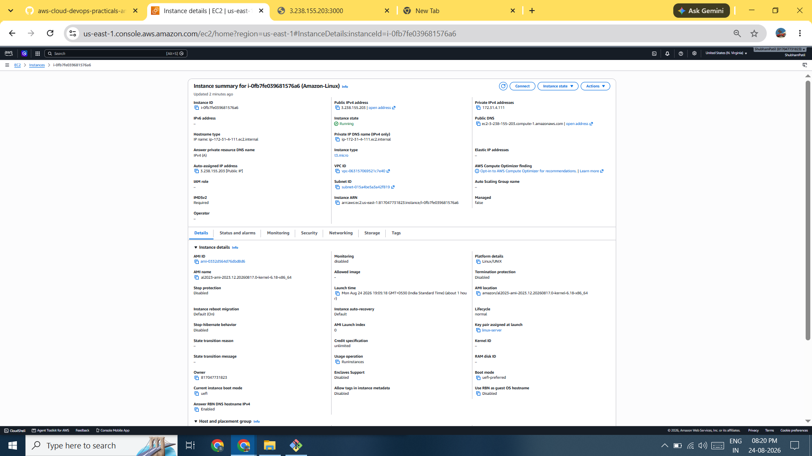
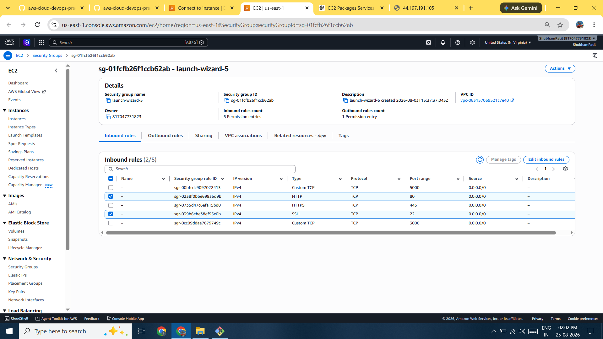
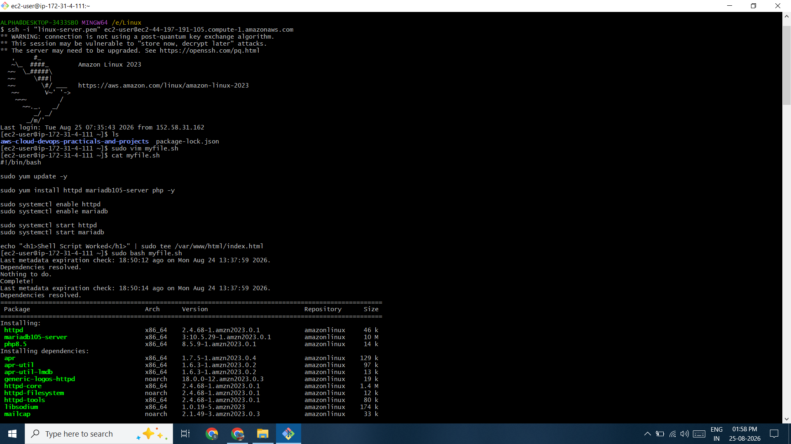
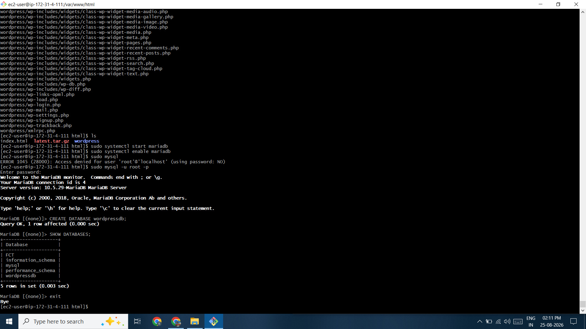
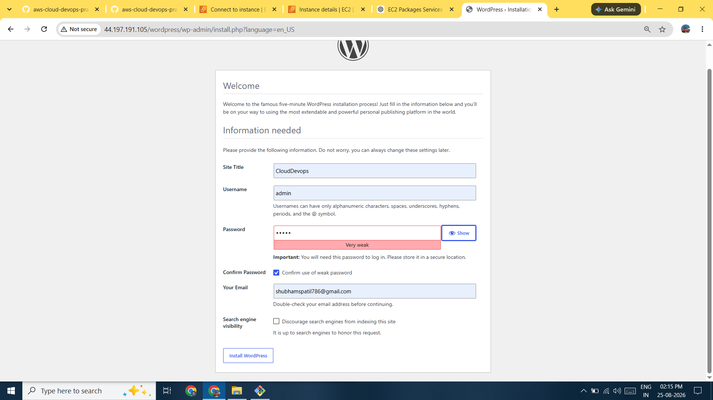
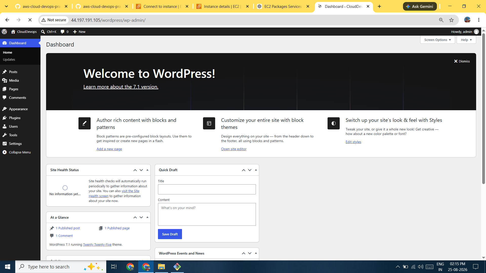
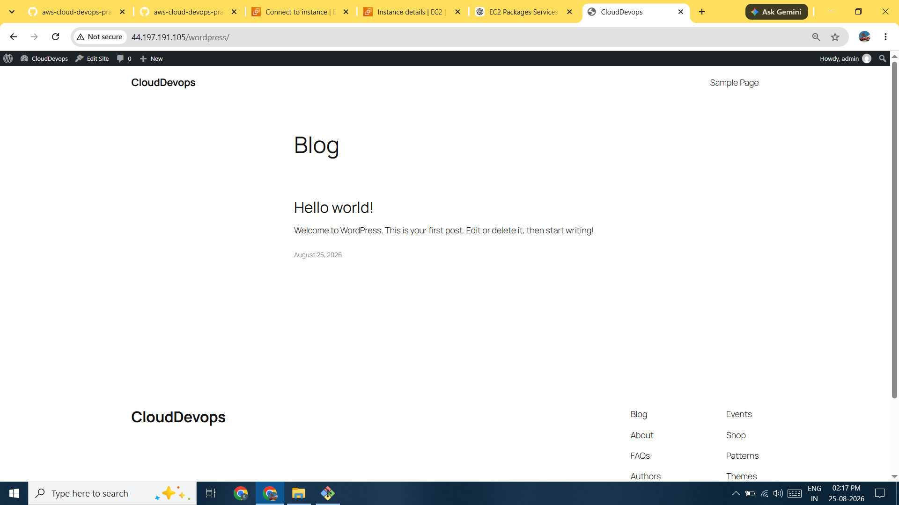

# 🚀 WordPress Deployment on AWS EC2 Using LAMP Stack & Shell Scripting

A hands-on AWS deployment project demonstrating how to deploy a **WordPress dynamic website on an AWS EC2 instance** using the **LAMP stack** and automate server configuration with a **Bash shell script**.

The project covers Linux shell scripting, Apache web server configuration, PHP, MariaDB/MySQL database setup, WordPress installation, file permissions, database configuration, and WordPress administration.

---

## 📌 Project Overview

WordPress is a dynamic Content Management System (CMS) that requires a web server, database server, and PHP runtime.

This project follows the architecture:

```text
                    Internet
                       │
                       ▼
                 AWS EC2 Instance
                 ┌───────────────┐
                 │ Amazon Linux  │
                 └───────┬───────┘
                         │
                         ▼
                    Apache HTTPD
                         │
                         ▼
                       PHP
                         │
                         ▼
                  MariaDB / MySQL
                         │
                         ▼
                    WordPress
```

### LAMP Stack

```text
L → Linux
A → Apache
M → MariaDB / MySQL
P → PHP
```

---

# 🛠️ Technologies Used

| Technology    | Purpose                   |
| ------------- | ------------------------- |
| AWS EC2       | Cloud server              |
| Amazon Linux  | Operating system          |
| Bash          | Shell scripting           |
| Apache HTTPD  | Web server                |
| PHP           | WordPress runtime         |
| MariaDB/MySQL | WordPress database        |
| WordPress     | Content Management System |
| Git           | Version control           |
| SSH           | Remote server access      |

---

# 🎯 Project Objectives

* Launch an AWS EC2 instance
* Connect to EC2 using SSH
* Understand Linux shell scripting
* Automate LAMP stack installation
* Configure Apache
* Install PHP and PHP-FPM
* Install MariaDB
* Create a WordPress database
* Download and configure WordPress
* Configure file permissions
* Complete WordPress installation
* Access the WordPress website through the EC2 public IP
* Access the WordPress administration dashboard

---

# 🖥️ Part 1 — Shell Scripting

## What is Shell Scripting?

A shell script is a file containing multiple Linux commands that are executed automatically in sequence.

Example:

```bash
#!/bin/bash

echo "Hello World"
```

The first line:

```bash
#!/bin/bash
```

is called the **shebang**.

It tells Linux to execute the script using the Bash shell.

---

# ▶️ Running a Shell Script

A script can be executed using:

```bash
sudo bash <file.sh>
```

or:

```bash
sudo sh <file.sh>
```

If executable permission has been granted:

```bash
sudo chmod +x <file.sh>
```

then:

```bash
sudo ./<file.sh>
```

---

# ⚙️ LAMP Installation Using Shell Script

Create the shell script:

```bash
vim myfile.sh
```

Example:

```bash
#!/bin/bash

sudo yum update -y

sudo yum install httpd mariadb105-server php -y

sudo systemctl enable httpd
sudo systemctl enable mariadb

sudo systemctl start httpd
sudo systemctl start mariadb

echo "<h1>Shell Script Worked</h1>" | sudo tee /var/www/html/index.html
```

> Package names can vary depending on the Amazon Linux version and enabled repositories. Verify the package names for the specific EC2 AMI being used.

---

# ▶️ Execute the Script

```bash
sudo bash myfile.sh
```

Check Apache:

```bash
sudo systemctl status httpd
```

Check MariaDB:

```bash
sudo systemctl status mariadb
```

Then test the web server:

```text
http://<EC2-PUBLIC-IP>
```

Expected result:

```text
Shell Script Worked
```

---

# 🔐 EC2 Security Group

For the Apache website to be accessible from the internet, configure the EC2 Security Group.

### Inbound Rules

```text
SSH
Port: 22
Source: Your IP

HTTP
Port: 80
Source: 0.0.0.0/0
```

Then access:

```text
http://<EC2-PUBLIC-IP>
```

---

# 🌐 Part 2 — WordPress Deployment

## WordPress Architecture

```text
              User
                │
                ▼
          EC2 Public IP
                │
                ▼
             Apache
                │
                ▼
              PHP
                │
        ┌───────┴───────┐
        ▼               ▼
   WordPress        PHP-FPM
        │
        ▼
     MariaDB
```

---

# 📥 1. Download WordPress

Navigate to the Apache document root:

```bash
cd /var/www/html
```

Download WordPress:

```bash
sudo wget https://wordpress.org/latest.tar.gz
```

Verify the downloaded file:

```bash
ls
```

Expected:

```text
latest.tar.gz
```

---

# 📦 2. Extract WordPress

Extract the archive:

```bash
sudo tar -xvzf latest.tar.gz
```

### `tar` Options

```text
-x → Extract
-v → Verbose output
-z → gzip compressed archive
-f → File name follows
```

After extraction:

```bash
ls
```

You should see:

```text
latest.tar.gz
wordpress/
```

---

# 🗄️ 3. Configure MariaDB

Start MariaDB:

```bash
sudo systemctl start mariadb
```

Enable MariaDB at boot:

```bash
sudo systemctl enable mariadb
```

Access MariaDB:

```bash
sudo mysql
```

---

# 🔑 4. Create WordPress Database

Inside the MariaDB/MySQL shell:

```sql
CREATE DATABASE wordpressdb;
```

Check the databases:

```sql
SHOW DATABASES;
```

Exit:

```sql
EXIT;
```

---

# 🔐 Database Credentials

During the WordPress installation, provide:

```text
Database Name: wordpressdb
Username:      <database-user>
Password:      <database-password>
Database Host: localhost
Table Prefix:  wp_
```

### Security Note

Do **not** commit real database passwords, WordPress administrator passwords, API keys, or other secrets to GitHub.

Use placeholders in documentation:

```text
<DB_USERNAME>
<DB_PASSWORD>
```

---

# 📁 5. WordPress File Permissions

Apache needs appropriate permissions to access the WordPress files.

Check the current permissions:

```bash
ls -ld /var/www/html/wordpress
```

A common Apache ownership configuration is:

```bash
sudo chown -R apache:apache /var/www/html/wordpress
```

Check again:

```bash
ls -ld /var/www/html/wordpress
```

Example:

```text
drwxr-xr-x ... apache apache ... wordpress
```

> Exact ownership requirements can vary depending on the Linux distribution and Apache/PHP configuration.

---

# 🌐 6. WordPress Installation

Open the WordPress installation page:

```text
http://<EC2-PUBLIC-IP>/wordpress
```

WordPress will ask for database information.

Enter:

```text
Database Name: wordpressdb
Username:      <DB_USERNAME>
Password:      <DB_PASSWORD>
Database Host: localhost
Table Prefix:  wp_
```

Click:

```text
Submit
```

Then continue with the WordPress installation.

---

# 📝 7. WordPress Installation Details

Provide:

```text
Site Title:
My AWS Website

Username:
<ADMIN_USERNAME>

Password:
<STRONG_ADMIN_PASSWORD>

Your Email:
<YOUR_EMAIL>
```

Then click:

```text
Install WordPress
```

After successful installation, WordPress will provide the option to log in.

---

# 🔑 8. WordPress Login

After installation:

```text
http://<EC2-PUBLIC-IP>/wordpress/wp-admin
```

Enter the administrator credentials created during installation.

You will then enter the:

```text
WordPress Dashboard
```

---

# 🌍 9. Visit the Website

Public WordPress website:

```text
http://<EC2-PUBLIC-IP>/wordpress
```

WordPress Admin Dashboard:

```text
http://<EC2-PUBLIC-IP>/wordpress/wp-admin
```

---

# 🧪 Testing

## Test 1 — Apache

```bash
sudo systemctl status httpd
```

Expected:

```text
Active: active (running)
```

---

## Test 2 — MariaDB

```bash
sudo systemctl status mariadb
```

Expected:

```text
Active: active (running)
```

---

## Test 3 — PHP

Check PHP:

```bash
php --version
```

---

## Test 4 — WordPress

Open:

```text
http://<EC2-PUBLIC-IP>/wordpress
```

The WordPress website should load successfully.

---

# 🔍 Troubleshooting

## Apache Not Running

Check:

```bash
sudo systemctl status httpd
```

Start Apache:

```bash
sudo systemctl start httpd
```

Enable Apache:

```bash
sudo systemctl enable httpd
```

---

## MariaDB Not Running

Check:

```bash
sudo systemctl status mariadb
```

Start:

```bash
sudo systemctl start mariadb
```

Enable:

```bash
sudo systemctl enable mariadb
```

---

## Permission Denied

Check WordPress ownership:

```bash
ls -ld /var/www/html/wordpress
```

Set Apache ownership:

```bash
sudo chown -R apache:apache /var/www/html/wordpress
```

---

## Website Not Opening

Check the EC2 Security Group.

Make sure HTTP is allowed:

```text
Type:   HTTP
Port:   80
Source: 0.0.0.0/0
```

Then access:

```text
http://<EC2-PUBLIC-IP>/wordpress
```

---

# 📊 Project Workflow

```text
1. Launch EC2
      │
      ▼
2. Connect Using SSH
      │
      ▼
3. Amazon Linux
      │
      ▼
4. Run Shell Script
      │
      ├── Apache
      ├── MariaDB
      └── PHP
      │
      ▼
5. Download WordPress
      │
      ▼
6. Extract WordPress
      │
      ▼
7. Create Database
      │
      ▼
8. Configure Permissions
      │
      ▼
9. WordPress Installation
      │
      ▼
10. WordPress Dashboard
      │
      ▼
11. Live Website
```

---

# 📚 Key Learnings

Through this project, I learned:

* Linux shell scripting
* Bash shebang and script execution
* Linux package installation using `yum`
* AWS EC2 deployment
* Apache web server configuration
* PHP installation and configuration
* MariaDB database management
* WordPress deployment
* Database creation
* Linux file ownership and permissions
* WordPress administration
* EC2 Security Group configuration
* Dynamic website deployment
* Basic server automation

---

# 🚀 Future Improvements

The project can be extended into a more production-ready architecture by adding:

* Custom domain name
* Route 53 DNS
* HTTPS/SSL using Let's Encrypt
* Nginx reverse proxy
* AWS Application Load Balancer
* Amazon RDS for MySQL/MariaDB
* Amazon CloudWatch monitoring
* EC2 Auto Scaling
* Automated backups
* GitHub Actions CI/CD
* Infrastructure as Code using Terraform
* AWS IAM best practices

### Improved Production Architecture

```text
                         Users
                           │
                           ▼
                     Route 53 DNS
                           │
                           ▼
                       HTTPS/SSL
                           │
                           ▼
                Application Load Balancer
                           │
                           ▼
                    EC2 Auto Scaling
                           │
                           ▼
                     Apache / PHP
                           │
                           ▼
                       WordPress
                           │
                           ▼
                    Amazon RDS MySQL
```

---

# 📸 Screenshots

## EC2 Instance : 


## Security Group : 


## Shell Script : 


## WordPress Database : 


## WordPress Installation : 


## WordPress Dashboard : 


## Live Website : 


---

# 👨‍💻 Author

**Shubham Patil**  
B.Tech Computer Science & Engineering Student  
Aspiring AWS Cloud Engineer | Linux | AWS | Cloud & DevOps

---

# ⭐ Project Highlights

```text
AWS EC2
   ↓
Amazon Linux
   ↓
Bash Shell Script
   ↓
LAMP Stack
   ↓
Apache + PHP + MariaDB
   ↓
WordPress
   ↓
Dynamic Website
```

> This project demonstrates practical AWS, Linux, shell scripting, LAMP stack, database, and WordPress deployment skills by hosting a dynamic CMS website on an EC2 instance.
