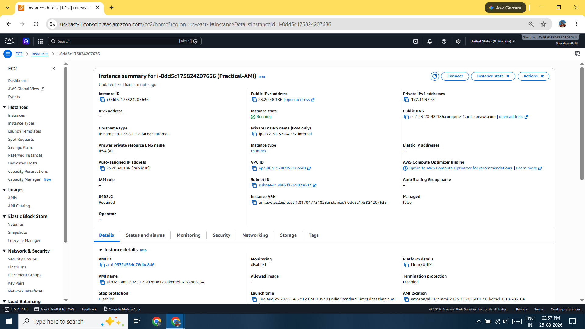
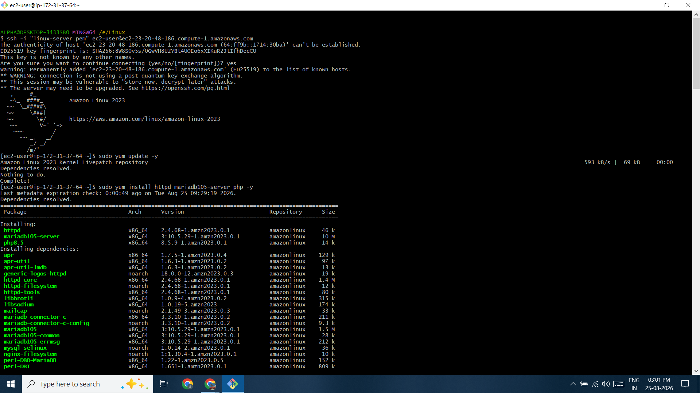
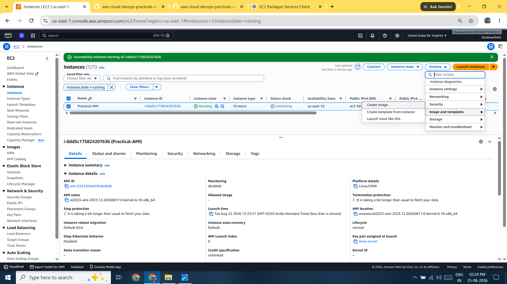
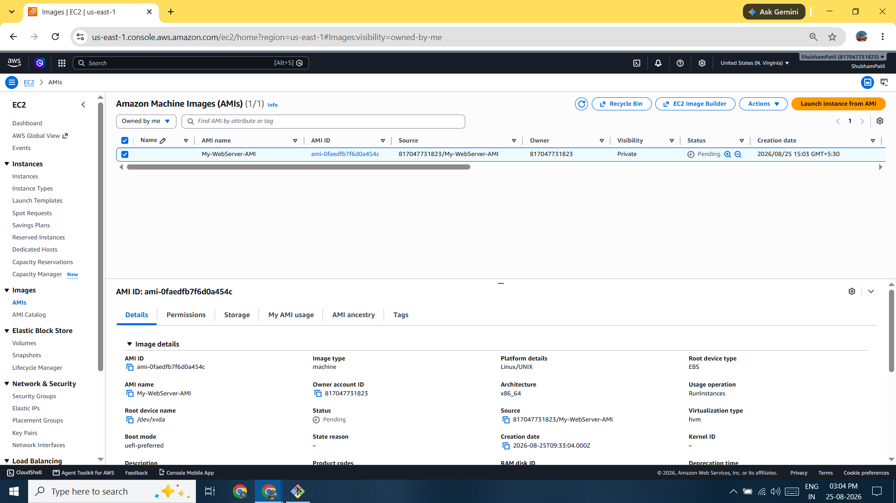
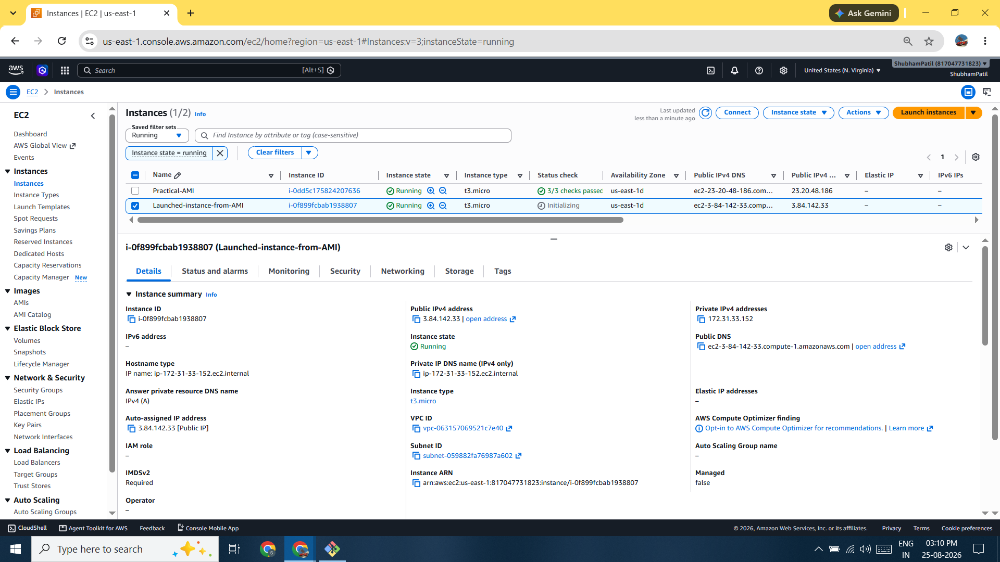
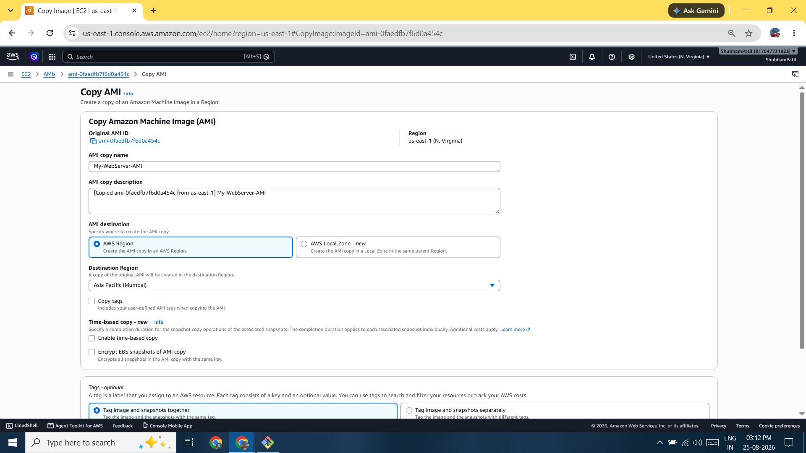
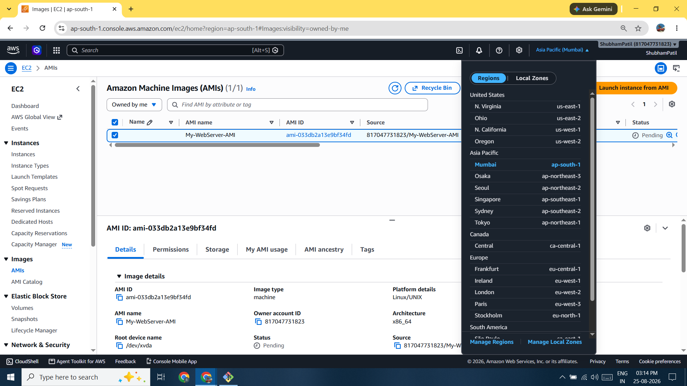
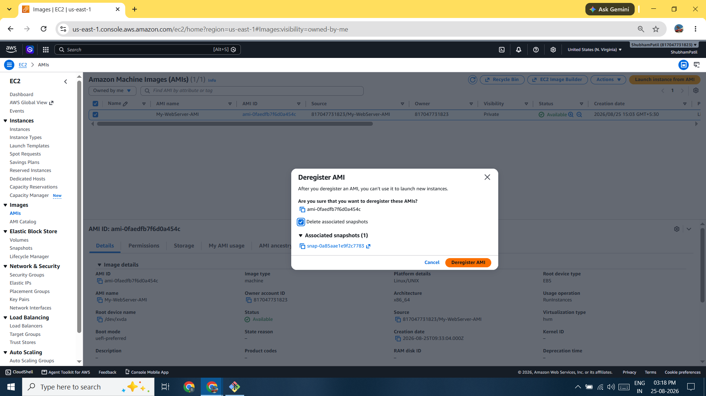

# AWS AMI Practical

## 📌 Project Overview

This practical demonstrates how to work with **Amazon Machine Images (AMIs)** in AWS.

An **AMI (Amazon Machine Image)** is a reusable template used to launch Amazon EC2 instances. It contains the required configuration of an EC2 instance, such as:

* Operating System
* Installed software
* Applications
* Configuration
* Attached EBS volume information

Using an AMI, you can create multiple EC2 instances with the same configuration.

---

## 🎯 Objectives

In this practical, the following AMI operations are performed:

1. Launch an EC2 instance
2. Create an AMI from an EC2 instance
3. Find the created AMI
4. Launch a new EC2 instance from the AMI
5. Copy an AMI to another AWS Region
6. Check the copied AMI in the destination Region
7. Share an AMI with another AWS account
8. Find a shared AMI
9. Deregister an AMI

---

# 🔹 What is an AMI?

An **Amazon Machine Image (AMI)** is a blueprint or template of an EC2 instance.

For example, suppose an EC2 server is configured with:

```text id="ami001"
Amazon Linux
Apache
PHP
MySQL
Website Files
```

You can create an AMI from this configured EC2 instance. Later, multiple new EC2 instances can be launched using the same setup.

### Example

```text id="ami002"
Configured EC2 Server
        ↓
     Create AMI
        ↓
       AMI
      ↙   ↘
   EC2-1  EC2-2
```

---

# 🔹 Why Use an AMI?

AMIs are useful for:

* Creating a backup of an EC2 setup
* Launching multiple identical servers
* Quickly recreating a server
* Creating standard server templates
* Maintaining the same configuration across multiple instances
* Using the same setup with Auto Scaling Groups

---

# 1️⃣ Launch an EC2 Instance

First, launch a normal EC2 instance.

### Steps

```text id="ami003"
AWS Console
   ↓
EC2
   ↓
Launch Instance
   ↓
Select AMI
   ↓
Choose Instance Type
   ↓
Configure Key Pair
   ↓
Configure Security Group
   ↓
Launch Instance
```

After launching the instance, configure the server as required.

For example:

```text id="ami004"
Amazon Linux
     ↓
Apache
     ↓
PHP
     ↓
MySQL
     ↓
Your Website
```

---

# 2️⃣ Create an AMI from an EC2 Instance

After configuring the EC2 instance, create an AMI.

### Steps

```text id="ami005"
EC2
   ↓
Instances
   ↓
Select Configured Instance
   ↓
Actions
   ↓
Image and Templates
   ↓
Create Image
```

Enter the AMI name.

### Example

```text id="ami006"
Image Name: My-WebServer-AMI
```

Click:

```text id="ami007"
Create Image
```

AWS creates an AMI from the selected EC2 instance.

---

# 3️⃣ Find Your AMI

To view the AMI you created:

```text id="ami008"
EC2
   ↓
Images
   ↓
AMIs
```

Here you can find your newly created AMI.

The AMI acts as a reusable template for launching new EC2 instances.

---

# 4️⃣ Launch an EC2 Instance from an AMI

You can launch a new EC2 instance using your custom AMI.

### Steps

```text id="ami009"
EC2
   ↓
Images
   ↓
AMIs
   ↓
Select Your AMI
   ↓
Launch Instance from AMI
```

Configure the new instance:

* Instance Name
* Key Pair
* Security Group
* Instance Type

Then click:

```text id="ami010"
Launch Instance
```

### Result

```text id="ami011"
Original EC2
     ↓
    AMI
     ↓
New EC2
```

The new EC2 instance will have the same configuration as the original instance at the time the AMI was created.

---

# 5️⃣ Copy an AMI to Another Region

An AMI is a **regional resource**.

For example:

```text id="ami012"
Source Region:
US East (N. Virginia)

Destination Region:
Asia Pacific (Mumbai)
```

### Steps

```text id="ami013"
EC2
   ↓
Images
   ↓
AMIs
   ↓
Select AMI
   ↓
Actions
   ↓
Copy AMI
```

Select the destination Region:

```text id="ami014"
Asia Pacific (Mumbai)
```

Click:

```text id="ami015"
Copy AMI
```

AWS creates a separate copy of the AMI in the destination Region.

---

# 6️⃣ Check the Copied AMI in the Destination Region

Change the AWS Region:

```text id="ami016"
US East (N. Virginia)
        ↓
Asia Pacific (Mumbai)
```

Then navigate to:

```text id="ami017"
EC2
   ↓
Images
   ↓
AMIs
```

You should find the copied AMI.

### Important

```text id="ami018"
Virginia AMI ≠ Mumbai AMI
```

The copied AMI is a separate regional resource.

---

# 7️⃣ Share an AMI

An AMI can also be shared with another AWS account.

### Steps

```text id="ami019"
EC2
   ↓
Images
   ↓
AMIs
   ↓
Select AMI
   ↓
Actions
   ↓
Edit AMI Permissions
```

Select:

```text id="ami020"
Private
   ↓
Shared Accounts
   ↓
Enter AWS Account ID
   ↓
Save Permissions
```

After saving the permissions, the specified AWS account can access the shared AMI.

---

# 8️⃣ Find a Shared AMI

In the other AWS account:

```text id="ami021"
EC2
   ↓
Images
   ↓
AMIs
   ↓
Private Images
```

The shared AMI should appear in the available AMIs.

The user can then use the shared AMI according to the permissions granted by the owner.

---

# 9️⃣ Deregister an AMI

To remove an AMI:

```text id="ami022"
EC2
   ↓
Images
   ↓
AMIs
   ↓
Select AMI
   ↓
Actions
   ↓
Deregister AMI
```

Confirm the deregistration.

### Example

Suppose:

```text id="ami023"
Virginia
   ↓
AMI-1
   ↓
Copied AMI
   ↓
Mumbai
   ↓
AMI-2
```

If you deregister:

```text id="ami024"
AMI-1 in Virginia
```

Then:

```text id="ami025"
Virginia AMI → Deregistered ❌

Mumbai AMI → Still Exists ✅
```

This happens because the copied AMI is a separate regional resource.

---

# 📊 AMI Workflow

```text id="ami026"
Launch EC2 Instance
        ↓
Configure Server
        ↓
Install Applications
        ↓
Create AMI
        ↓
Launch Multiple Identical EC2 Instances
        ↓
Copy AMI to Another Region
        ↓
Share AMI with Another AWS Account
```

---

# 📁 Example Use Case

Suppose you configure a web server with:

```text id="ami027"
Amazon Linux
Apache
PHP
MySQL
Website Application
```

Instead of manually configuring every new EC2 instance, create an AMI:

```text id="ami028"
Configured Web Server
        ↓
     Create AMI
        ↓
       AMI
      ↙   ↘
   EC2-1  EC2-2
```

Both new instances can use the same server configuration.

---

# 🎓 Key Learnings

* What an Amazon Machine Image (AMI) is
* How to launch an EC2 instance
* How to create an AMI from an existing EC2 instance
* How to find a custom AMI
* How to launch an EC2 instance from an AMI
* How to copy an AMI between AWS Regions
* Understanding that AMIs are regional resources
* How to share an AMI with another AWS account
* How to find shared AMIs
* How to deregister an AMI

---

# 🏁 Result

Successfully created and managed an AWS AMI by:

* Creating an EC2 instance
* Configuring the EC2 server
* Creating a custom AMI
* Launching a new EC2 instance from the AMI
* Copying the AMI to another Region
* Sharing the AMI with another AWS account
* Finding the shared AMI
* Deregistering the original AMI

---

# 📸 Screenshots :

## Launch EC2 Instance :


## Configured EC2 Instance :


## Create AMI :


## Custom AMI Created :


## Launch Instance from AMI :


## Copy AMI to Another Region :


## Copied AMI in Mumbai :


## Deregister AMI :


---

# 🏁 Conclusion

This practical demonstrated the complete lifecycle of an **Amazon Machine Image (AMI)**. A configured EC2 instance was used to create a reusable server template. The AMI was then used to launch new EC2 instances with the same configuration.

The practical also demonstrated that AMIs are **regional resources**, can be **copied to another Region**, **shared with other AWS accounts**, and **deregistered** when no longer required. AMIs are an important feature for infrastructure standardization, backup, automation, and launching multiple identical servers.
